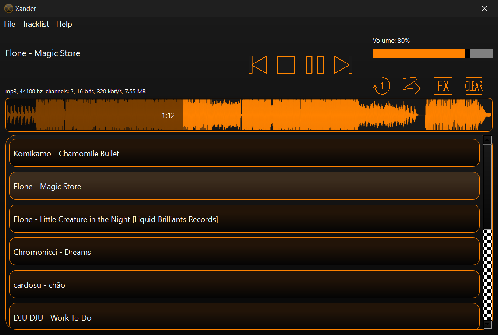

# Xander
Xander is a lightweight audio player created using XAudio2 and Qt. 

  

Features: 
- <b>Drag'n'Drop</b>. Drag'n'Drop files and folders to add music. 
- <b>Tracklists</b>. Save the current tracklist and open it later. 
- <b>Sound Effects</b>. Add sound effects to playing music. 
- <b>Oscillogram</b>. Click on the horizontal oscillogram to change the current track's position. 
- <b>Repeat section</b>. Click the right mouse button on the oscillogram to set the left bound for the repetition, click the right mouse button again to set the right bound and make a repetition section in which music will repeat. 
- <b>Tracklist management</b>. Use RMB to move or delete tracks in the tracklist (or use keyboard shortcuts). 
- <b>Search</b>. Use Ctrl + F to open the search window to search for the desired track in the tracklist. 
- <b>"Repeat Track" / "Random Track"</b>. Use buttons under the volume slider to enable "Repeat Track" / "Random Track" functions. 